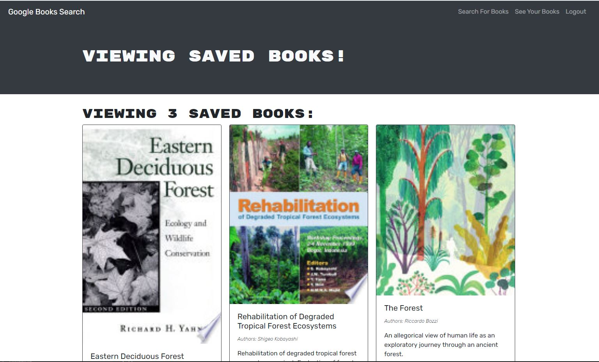

# book-search-engine

This project consisted of taking a fully functioning Google Books API search engine built with a RESTful API, and refactor it to be a GraphQL API built with Apollo Server.

User is able to search for books and save them in the database. User has to be logged-in/signed-up to the application in order to save the books.

# Technologies used

* MERN stack
* React, JSX
* MongoDB
* Node.js/Express.js and API

# GitHub repository

https://github.com/evkonradi/book-search-engine

# Deployed application:

 https://afternoon-beach-68765.herokuapp.com/

# Page preview

This is the preview of the initial page:

